# Revision Week: From Artificial Intelligence to Deployable AI Applications

## Session Overview

This revision-week session introduces artificial intelligence from a **developer and software-engineering perspective**.

We will briefly revise the relationship between:

- Artificial intelligence
- Machine learning
- Deep learning
- Large language models
- AI agents
- AI application deployment

We will then explore practical examples of how AI can be connected to documents, websites, APIs, databases, command-line tools, desktop applications, and web interfaces.

The session includes three demonstrations:

1. A **personal local AI agent**
2. An **AI-powered job downloader and résumé ranker**
3. Installing and running a Python application directly from GitHub

---

## Learning Outcomes

By the end of this session, students should be able to:

- Explain the difference between AI, machine learning, deep learning, LLMs, and AI agents
- Understand how language models are used inside software applications
- Explain the basic architecture of an AI agent
- Describe how text embeddings can compare a résumé with job descriptions
- Understand how PDFs and scanned documents can be processed
- Create and activate a Python environment
- Install Python packages using `pip`
- Install a Python project directly from GitHub
- Understand the basic stages of AI deployment
- Write more structured prompts
- Identify privacy, safety, and reliability risks in AI systems

---

# 1. Artificial Intelligence Overview

Artificial intelligence is the broad field of creating computer systems that perform tasks that normally require human intelligence.

Machine learning, deep learning, and large language models are all areas within artificial intelligence.

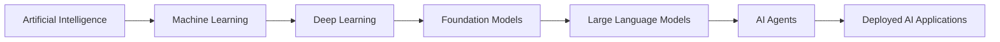

## Important Definitions

| Concept | Explanation | Example |
|---|---|---|
| Artificial Intelligence | The broad field of creating systems that perform intelligent tasks | Planning, recommendation, or decision-support systems |
| Machine Learning | Algorithms that learn patterns from data | Predicting house prices |
| Deep Learning | Machine learning using multi-layer neural networks | Image recognition |
| Foundation Model | A large model trained on broad datasets and adapted to different tasks | General language or vision models |
| Large Language Model | A model designed to process and generate human language | Chatbots and coding assistants |
| AI Agent | A system that combines an LLM with memory, instructions, and tools | An assistant that searches files and performs actions |
| Deployment | Making an application available to users | Local application, website, API, cloud service, or mobile application |

---

# 2. How a Large Language Model Works

A large language model receives text and divides it into smaller units called **tokens**.

The model processes these tokens and predicts which tokens should come next.

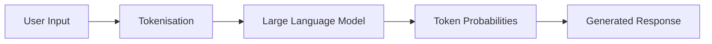

A large language model uses:

- The user’s current question
- System instructions
- Previous conversation
- Supplied documents
- Retrieved information
- Available software tools
- Patterns learned during training

An LLM does not understand the world exactly as a human does. It learns statistical patterns in language and uses those patterns to generate useful responses.

---

# 3. From Chatbots to AI Agents

A chatbot mainly produces text.

An AI agent can go further by using tools and performing controlled actions.

An agent may contain:

- A language model
- System instructions
- Short-term conversation context
- Long-term memory
- Local files
- Databases
- APIs
- Browser tools
- Code-execution tools
- Safety rules
- Human approval mechanisms

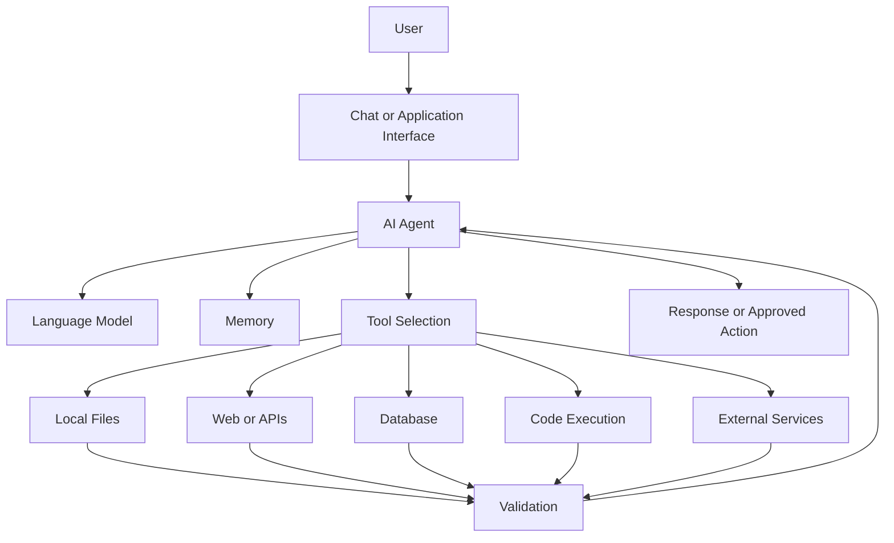

## A Simple Agent Loop

```text
Receive a goal
      ↓
Understand the request
      ↓
Create a plan
      ↓
Select a tool
      ↓
Run the tool
      ↓
Observe the result
      ↓
Validate the result
      ↓
Respond or continue
```

## Human Responsibility

AI agents should support human decision-making rather than remove human responsibility.

Humans should remain responsible for:

- Defining the goal
- Reviewing important outputs
- Checking factual claims
- Approving destructive operations
- Protecting private information
- Deciding whether the result is appropriate

---

# 4. Demonstration One: Personal Local AI Agent

## Personal AI Agent Demonstration

A personal AI agent runs on a user-controlled computer and can interact with authorised information and tools.

Example repository:

<https://github.com/MuhammadMuneeb007/openclaw>

The demonstration introduces:

- Local AI agents
- Tool calling
- Personal memory
- File access
- Application integrations
- Communication channels
- Privacy
- Permissions
- Prompt-injection risks
- Human approval

## Local Agent Architecture

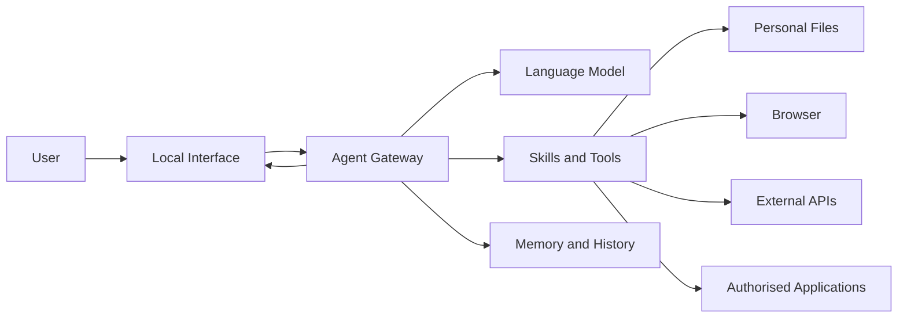

## Questions to Ask During the Demonstration

- Where is the agent running?
- Which language model is being used?
- What information can the agent access?
- What tools can the agent call?
- Is information stored locally or in the cloud?
- Can the user inspect the agent’s actions?
- What happens if a tool fails?
- Which actions require confirmation?
- How could the agent be manipulated by malicious instructions?

## Safety Principle

An agent should receive the **minimum permissions required** for its task.

For example, an agent that summarises documents should not automatically receive permission to:

- Delete files
- Uninstall applications
- Send emails
- Publish content
- Access unrelated folders
- Execute arbitrary commands

---

# 5. Demonstration Two: AI-Powered Job Ranking

## Project

**JobsDownloaderAndRanker**

<https://github.com/MuhammadMuneeb007/JobsDownloaderAndRanker>

This project demonstrates an end-to-end applied AI pipeline.

The system:

1. Downloads jobs from multiple job platforms
2. Cleans and standardises the job descriptions
3. Removes duplicate listings
4. Reads a résumé PDF
5. Uses text extraction or OCR
6. Compares the résumé with each job
7. Calculates multiple matching scores
8. Ranks the jobs
9. Displays the results in a local dashboard

## System Flowchart

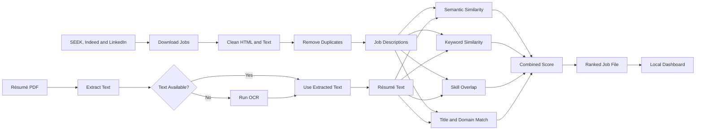

---

## Data Collection

The system collects job information from websites and job-search services.

This introduces developers to:

- APIs
- Web requests
- HTML parsing
- Wrapper libraries
- Browser automation
- Rate limits
- Error handling
- Terms of service

---

## Data Cleaning

Downloaded job descriptions may contain:

- HTML tags
- Repeated records
- Missing information
- Inconsistent spacing
- Different column names
- Incomplete descriptions

AI models do not automatically solve all data-quality problems.

A reliable application still requires normal software-development and data-engineering work.

---

## Processing a Résumé PDF

A résumé may be:

- A text-based PDF
- A scanned document
- An image
- A document with a complex layout

The application first attempts normal text extraction.

If text cannot be extracted, it can use **Optical Character Recognition**, or OCR.

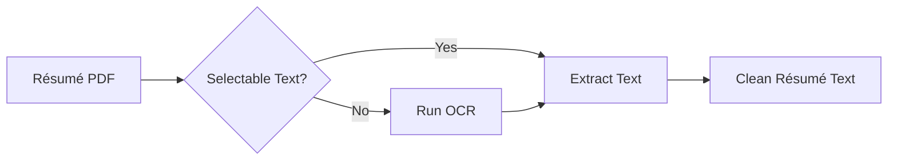

---

## Text Embeddings

A text embedding converts text into a numerical vector.

Texts with similar meanings should have vectors that are closer together.

```text
Résumé text        → Numerical vector
Job description    → Numerical vector
                              ↓
                     Similarity score
```

Example:

```text
Résumé:
"Developed deep-learning models using Python and PyTorch"

Job A:
"Seeking a machine-learning engineer with Python and PyTorch experience"

Job B:
"Seeking a retail sales assistant"
```

The résumé should receive a higher semantic-similarity score with Job A.

---

## Hybrid Ranking

A reliable ranking system should not depend on only one score.

The job ranker can combine:

- Semantic similarity
- TF-IDF or keyword similarity
- Job-title similarity
- Technical-skill overlap
- Domain relevance
- Location preferences
- Missing-skill penalties
- Description-quality penalties

```text
Final Match Score =
    Semantic Similarity
  + Keyword Similarity
  + Skill Overlap
  + Title Relevance
  + Domain Relevance
  - Mismatch Penalties
```

---

## Explainable Recommendations

A ranking is more useful when the user can understand why a job received a particular score.

The system can display:

- Matched skills
- Missing skills
- Semantic score
- Keyword score
- Skill score
- Combined score
- Short explanation

This is an example of **explainable AI**.

Users should be able to inspect recommendations instead of blindly trusting a ranking.

---

## Running the Project

Clone the repository:

```powershell
git clone https://github.com/MuhammadMuneeb007/JobsDownloaderAndRanker.git
cd JobsDownloaderAndRanker
```

Create the Conda environment:

```powershell
conda env create -f environment.yml
conda activate n8n-env
```

Alternatively:

```powershell
conda create -n n8n-env python=3.11 -y
conda activate n8n-env
python -m pip install --upgrade pip
python -m pip install -r requirements.txt
```

Run the pipeline:

```powershell
python Step1-DownloadJobsFromSeek.py
python Step2-CleanFile.py
python Step3-OCR-BERT-Rank.py
python Step3.1-OCR-BERT-Rank-Display.py
```

Open the local dashboard:

```text
http://127.0.0.1:8050/
```

---

# 6. Demonstration Three: Installing a Python Application from GitHub

## Project

**SystemSieve**

<https://github.com/MuhammadMuneeb007/SystemSieve>

SystemSieve is a Windows utility for:

- Reviewing installed software
- Finding application updates
- Examining storage usage
- Finding large or old files
- Previewing software-removal operations
- Running safe command-line or graphical workflows

This demonstration focuses on:

- Python packaging
- Command-line interfaces
- Graphical interfaces
- Local databases
- Testing
- Deployment
- Safety controls
- Installing directly from GitHub

---

## Install Directly from GitHub

```powershell
py -m pip install "git+https://github.com/MuhammadMuneeb007/SystemSieve.git@main"
```

Check the installation:

```powershell
systemsieve doctor
```

Launch the graphical interface:

```powershell
systemsieve gui
```

---

## Understanding the Installation Command

```text
py
└── Run the Python launcher

-m pip
└── Run pip through this Python installation

install
└── Install a Python package

git+https://...
└── Download the source from a Git repository

@main
└── Install the code from the main branch
```

---

## Installing from a Cloned Repository

```powershell
git clone https://github.com/MuhammadMuneeb007/SystemSieve.git
cd SystemSieve
```

Create a virtual environment:

```powershell
py -m venv .venv
```

Activate it:

```powershell
.venv\Scripts\activate
```

Install the project in editable development mode:

```powershell
py -m pip install -e ".[dev]"
```

Run the application:

```powershell
systemsieve gui
```

---

## Safety-First Software Design

System utilities may perform destructive actions such as uninstalling software or deleting files.

A safer application should generate a plan before execution.

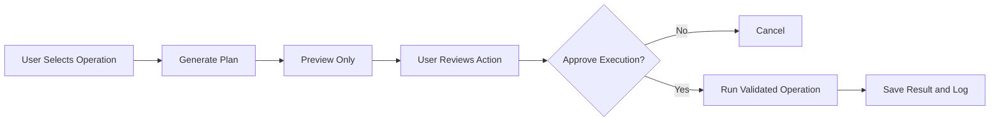

Useful safety mechanisms include:

- Preview or dry-run mode
- Protected system paths
- Validated commands
- Confirmation dialogs
- Operation logs
- Clear error reporting
- Recovery options
- Least-privilege execution

---

# 7. AI-Powered Programming Assistants

Example project:

**AI-Powered Python Learning Assistant**

<https://github.com/MuhammadMuneeb007/AI-Powered-Python-Learning-Assistant>

This type of application combines:

- An AI chat interface
- Code generation
- A Python code editor
- File uploads
- Code execution
- Error display
- Downloadable outputs
- A web interface

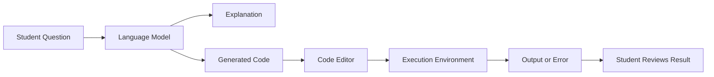

## Important Security Lesson

AI-generated code must not automatically be trusted.

Generated code could:

- Delete files
- Access private information
- Make unwanted network requests
- Enter an infinite loop
- Consume excessive memory
- Install unwanted packages
- Expose credentials

Production applications should execute untrusted code inside a restricted environment, sandbox, container, or virtual machine.

---

# 8. Domain-Specific Large Language Models

Example project:

**BioStarsGPT**

<https://github.com/MuhammadMuneeb007/BioStarsGPT>

A general-purpose LLM may not perform well enough in a specialised field.

A domain-specific system may use:

- Specialised datasets
- Prompt engineering
- Retrieval-augmented generation
- Supervised fine-tuning
- Human evaluation
- Automatic metrics
- Citation checking

## Domain-Specific AI Pipeline

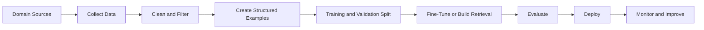

## Dataset Questions

Before using a dataset, developers should ask:

- Who created the data?
- Can the data legally be reused?
- Does it contain personal information?
- Are the answers accurate?
- Is the dataset representative?
- Are there duplicate examples?
- Is the test dataset separate from training data?
- How will hallucinations be detected?
- Should the model provide citations?

---

# 9. Prompt Engineering

Prompt engineering is the process of writing clear and structured instructions for an AI model.

A strong prompt can contain:

1. Role
2. Goal
3. Context
4. Input
5. Constraints
6. Output format
7. Examples
8. Verification requirements

## Prompt Template

```text
Role:
You are a...

Goal:
Your task is to...

Context:
The user is working with...

Input:
The following information is available...

Constraints:
- Do not...
- Only use...
- Keep the answer...
- Ask for confirmation before...

Output format:
Return the result as...

Quality checks:
Before answering, verify that...
```

---

## Weak Prompt

```text
Rank these jobs.
```

## Improved Prompt

```text
You are a job-matching assistant.

Compare the supplied résumé with each job description.

For every job:

1. Calculate a match score from 0 to 100.
2. Identify matching technical skills.
3. Identify important missing skills.
4. Explain the score in no more than three sentences.
5. Do not infer experience that is not present in the résumé.

Return a table with these columns:

Rank | Job Title | Match Score | Matching Skills |
Missing Skills | Explanation
```

## Prompt Engineering Is Not the Complete Solution

A good prompt cannot solve every software problem.

Reliable AI applications also require:

- Good-quality data
- Appropriate models
- Deterministic code
- Input validation
- Structured outputs
- Tests
- Monitoring
- Human review
- Security controls

---

# 10. Processing PDFs and Documents with AI

A common AI application allows users to ask questions about documents.

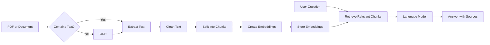

## Important Components

### Text Extraction

Used for digitally generated PDFs.

### Optical Character Recognition

Used for scanned documents and images.

### Chunking

Large documents are divided into smaller sections.

### Embeddings

Each section is converted into a numerical vector.

### Retrieval

The system finds the sections most relevant to the question.

### Generation

The LLM generates an answer using the retrieved information.

### Citations

The application should show which sections support the answer.

---

# 11. Setting Up a Python Development Environment

A virtual environment keeps project packages separate from other projects.

This reduces dependency conflicts.

## Check Your Installation

Open Command Prompt, PowerShell, Anaconda Prompt, or Miniforge Prompt.

```powershell
python --version
py --version
git --version
conda --version
where python
```

---

## Option A: Conda Environment

Create an environment:

```powershell
conda create -n applied-ai python=3.11 -y
```

Activate it:

```powershell
conda activate applied-ai
```

Install packages:

```powershell
python -m pip install pandas scikit-learn sentence-transformers streamlit
```

View available environments:

```powershell
conda info --envs
```

View installed packages:

```powershell
conda list
```

Export the environment:

```powershell
conda env export > environment.yml
```

Create an environment from a file:

```powershell
conda env create -f environment.yml
```

Deactivate the environment:

```powershell
conda deactivate
```

---

## Option B: Python Virtual Environment

Create the environment:

```powershell
py -m venv .venv
```

Activate it in Command Prompt:

```bat
.venv\Scripts\activate
```

Activate it in PowerShell:

```powershell
.venv\Scripts\Activate.ps1
```

Upgrade `pip`:

```powershell
python -m pip install --upgrade pip
```

Install dependencies:

```powershell
python -m pip install -r requirements.txt
```

Save the installed package versions:

```powershell
python -m pip freeze > requirements.txt
```

Deactivate:

```powershell
deactivate
```

---

# 12. Essential Command-Line Commands

## Navigation

```bat
dir
cd folder-name
cd ..
cd \
mkdir new-folder
cls
```

## Python

```bat
python --version
python script.py
python -m pip --version
python -m pip list
python -m pip install package-name
python -m pip uninstall package-name
```

## Git

```bat
git clone REPOSITORY_URL
git status
git add .
git commit -m "Describe the change"
git pull
git push
```

## Diagnostics

```bat
where python
where pip
where git
where conda
python -c "import sys; print(sys.executable)"
python -m pip check
```

Using:

```powershell
python -m pip
```

is generally safer than typing only:

```powershell
pip
```

because it makes the Python installation being used more explicit.

---

# 13. How an AI Application Is Deployed

A model by itself is not a complete application.

A deployed AI application may include:

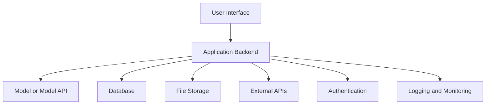

## Deployment Options

| Deployment Type | Example | Suitable For |
|---|---|---|
| Python script | `python app.py` | Automation and experiments |
| Notebook | Jupyter Notebook | Learning and exploration |
| Local GUI | Desktop Python application | Personal software |
| Local web app | Streamlit or Dash | Demonstrations and internal tools |
| API | FastAPI or Flask | Connecting AI to other systems |
| Container | Docker | Reproducible deployment |
| Cloud application | Azure, AWS, Google Cloud, or Vercel | Public or organisational use |
| Mobile or edge app | On-device model | Offline and privacy-sensitive tasks |

## Development Progression

```text
Idea
  ↓
Small Python Script
  ↓
Test with Sample Data
  ↓
Create Reusable Functions
  ↓
Add a Command-Line Interface
  ↓
Add a Graphical or Web Interface
  ↓
Package the Project
  ↓
Add Tests
  ↓
Create a Release
  ↓
Deploy and Monitor
```

---

# 14. Developer Checklist for an AI Project

## Problem

- What problem are we solving?
- Who is the user?
- Does the task require AI?
- Could normal software solve the problem more reliably?

## Data

- Where does the data come from?
- Is data collection permitted?
- Is the information accurate?
- Does the data contain private information?
- How will the data be cleaned?

## Model

- Which model is appropriate?
- Can it run locally?
- How much memory is required?
- Is an external API required?
- What is the expected cost?

## Application

- How will users provide input?
- How will results be displayed?
- Which tools can the application access?
- What happens when a dependency fails?

## Evaluation

- What does a correct result look like?
- Which metrics will be used?
- Will humans review the result?
- How will hallucinations be detected?
- How will incorrect actions be prevented?

## Deployment

- Where will the application run?
- How will dependencies be installed?
- Where will secrets and API keys be stored?
- How will the application be updated?
- How will errors be monitored?

---

# 15. Classroom Activities

## Activity 1: Improve a Prompt

Improve the following prompt:

```text
Tell me about this job.
```

Include:

- A role
- A clear goal
- Context
- Constraints
- Output format
- Verification requirements

---

## Activity 2: Design a Job-Ranking Formula

Assign weights to:

- Semantic similarity
- Technical skills
- Job-title similarity
- Location
- Experience
- Education
- Missing essential skills

Example:

```text
Final Score =
    40% Semantic Similarity
  + 25% Skill Overlap
  + 15% Job-Title Similarity
  + 10% Domain Relevance
  + 10% Location Preference
```

Explain why you selected each weight.

---

## Activity 3: Design an AI Agent

Choose one application:

- Revision assistant
- University timetable assistant
- Assignment organiser
- Document-search agent
- Personal expense assistant
- Job-search assistant

Complete the following:

```text
Goal:

Inputs:

Language Model:

Tools:

Memory:

Outputs:

Permissions:

Risks:

Human Approval:
```

---

## Activity 4: Inspect a GitHub Repository

Identify:

- README
- Licence
- Installation instructions
- Dependencies
- Source-code directory
- Tests
- Issues
- Releases
- Security documentation

Before installing a repository, consider whether you trust:

- The source
- The maintainer
- The installation scripts
- The required permissions
- The dependencies

---

## Activity 5: Explain the JobRanker Pipeline

Explain each stage:

```text
Download
    ↓
Clean
    ↓
Extract Résumé
    ↓
Create Text Representations
    ↓
Calculate Similarity
    ↓
Combine Scores
    ↓
Rank Jobs
    ↓
Display Results
```

Identify which stages involve:

- Normal programming
- Data engineering
- Machine learning
- User-interface development
- Software deployment

---

# 16. Possible Student Projects

Students could build:

- A résumé skill-gap analyser
- A cover-letter generator
- An assignment-question classifier
- A local PDF question-answering application
- An AI revision chatbot
- A course-material search engine
- An explainable recommendation system
- A Streamlit interface for a Python script
- A FastAPI endpoint for a machine-learning model
- A Docker container for a Python application
- A file-organising agent with preview mode
- A local personal knowledge assistant

---

# 17. Learning Roadmap

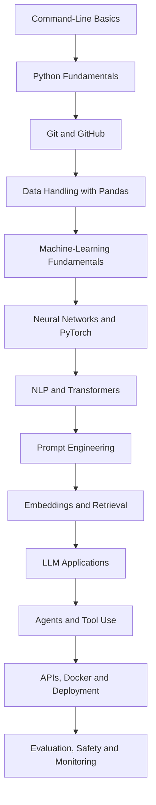

---

# 18. Recommended Learning Resources

## Python and Environments

- Python Tutorial:  
  <https://docs.python.org/3/tutorial/>

- Python Packaging Guide:  
  <https://packaging.python.org/en/latest/guides/installing-using-pip-and-virtual-environments/>

- Conda Getting Started:  
  <https://docs.conda.io/projects/conda/en/latest/user-guide/getting-started.html>

- Managing Conda Environments:  
  <https://docs.conda.io/projects/conda/en/stable/user-guide/tasks/manage-environments.html>

## Git and GitHub

- GitHub Getting Started:  
  <https://docs.github.com/en/get-started>

- Git Documentation:  
  <https://git-scm.com/doc>

- Pro Git Book:  
  <https://git-scm.com/book/en/v2>

## AI and Machine Learning

- Machine-Learning Roadmap:  
  <https://roadmap.sh/machine-learning>

- AI Engineer Roadmap:  
  <https://roadmap.sh/ai-engineer>

- Prompt Engineering Roadmap:  
  <https://roadmap.sh/prompt-engineering>

- Hugging Face LLM Course:  
  <https://huggingface.co/learn/llm-course/chapter1/1>

- PyTorch Tutorials:  
  <https://pytorch.org/tutorials/beginner/basics/intro.html>

- Scikit-learn Tutorials:  
  <https://scikit-learn.org/stable/tutorial/index.html>

## Application Development

- Streamlit Documentation:  
  <https://docs.streamlit.io/>

- Dash Documentation:  
  <https://dash.plotly.com/>

- FastAPI Tutorial:  
  <https://fastapi.tiangolo.com/tutorial/>

- Docker Getting Started:  
  <https://docs.docker.com/get-started/>

- Mermaid Diagrams:  
  <https://mermaid.js.org/intro/>

---

# 19. Key Message

Artificial intelligence is not only a model.

A useful AI application normally combines:

```text
Problem Definition
+ Data
+ Model
+ Prompt
+ Deterministic Code
+ Tools
+ User Interface
+ Storage
+ Security
+ Evaluation
+ Deployment
```

The strongest AI developers are not simply people who know how to send a request to an LLM.

They understand how to transform a model into a useful, explainable, secure, testable, and deployable software system.

---

# Exit Questions

1. What is the difference between machine learning and deep learning?
2. What is a large language model?
3. What makes an AI agent different from a chatbot?
4. Why do developers use virtual environments?
5. What is a text embedding?
6. How can a résumé be compared with a job description?
7. Why should an AI ranking system provide explanations?
8. What happens when we install a package from GitHub?
9. Why should destructive actions use preview mode?
10. What information belongs in a strong prompt?
11. What components are required to deploy an AI model?
12. What risks should be considered before giving an agent access to personal files?
